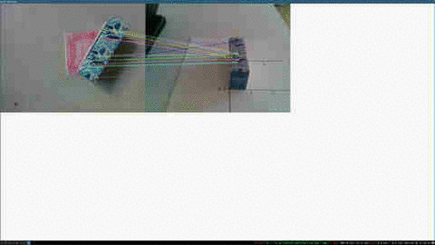

This repo provides four different grasping technologies with the Niryo One robot arm. These techniques range from simple image matching to more precise but more involved grasp pose detection.


Basic Aspects
-------------
Instruction the robot to condut different grasp strategies is very similar.
Each approach requires setting up the camera, some form of graps generation,
and a reception of the grasp frame to imply the robot to move.


Image Matching
--------------
Image matching produces fast and relatively robust results. In contrast to the three other techniques discussed, image matching does not need to integrate different RGBD frames into a global scene but can instead work with only one image. However, the feature detection algorithms are not as robust as the geometric registration algorithms below, so the quality of the grasp pose is a bit lower. The instructions to invoke grasping based on image matching are:

```shell
roslaunch generate_images broadcast_transform.launch
roslaunch pose_detection visual_pose.launch
roslaunch new_pick_place picking.launch
```
As seen in the accompanying video, the position estimates are robust, but the yaw angles fluctuate slightly.   


Centroid Estimation
----------
Estimating the centroid determines the grasp location of objects with little yaw very flexibly because centroids can be calculated without any templates. However, the centroid represents only a point without orientation. Therefore, objects without pronounced yaw get grasped properly, while others might not be picked.
```shell
roslaunch generate_images broadcast_transform.launch
roslaunch integration integration_and_clustering.launch
roslaunch new_pick_place picking.launch
```
This video show objects for which no template is available. If the object is oriented similar to the robot, the gripper can pick up the object very well.   


Geomertic Matching (Point Cloud Registration)
---------------------------------------------
This approach allows computing grasp poses based on matching a 3D template with the segmented scene through ICP. Grasps are centered in the object, and the gripper approaches objects from the negative x-direction and positive z-direction of the grasp frame. Because the gripper's pitch is fixed to Pi/2, few collisions with other objects occur even without setting cautious waypoints. However, the grasp orientation might not lead to firm force closure, and objects might slip out of the gripper's hand.

```shell
roslaunch generate_images broadcast_transform.launch
roslaunch integration integration_and_pose_estimation.launch
roslaunch new_pick_place picking.launch
```
The video for this grasping technique is very similar to the video shown for the GPD technique. The robot first circles the scene to integrate different RGBD images. Then, the ICP algorithm matches object templates with the scene to determines the object's pose. The gripper then approaches the objects "from above" to pick them up.


GPD
---
Interacting with GPD requires the GPD repo as a dependency. GPD consists of the core GPD module and the GPD-ROS repo. GPD provides grasp poses directly on the point cloud of objects and chooses a picking pose that maximizes force closure of the gripper. In contrast, the other techniques solely grasp "from above". To run GPD launch the following files:

```shell
roslaunch generate_images broadcast_transform.launch
roslaunch integration integration_and_pose_estimation.launch
roslaunch new_pick_place picking.launch
```
A vide of the result can be seen below:  

At arm moves at first around a pre-specified trajectory to collect RGBD
images. The images are registered and integrated into an entire scene. The object's location needs to be determined through geometric registration first before picking it up. These steps are identical to the grasping technique described above. GDP then suggests different grasps for the identified object. Finally, the robot grasps the object. Rviz shows the waypoints for the grasping trajectory. Although GPD can generate high-quality grasps, approaching the object from other positions than from above requires a larger workspace for the robot. Extra care for selecting a safe trajectory is needed and to avoid collisions with the ground, itself, or the object.


